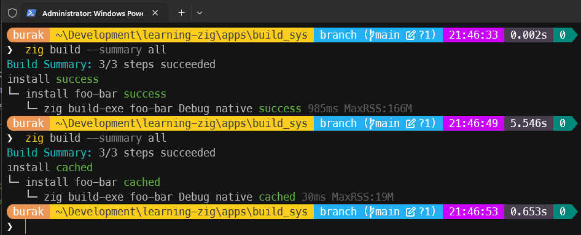
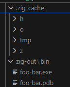
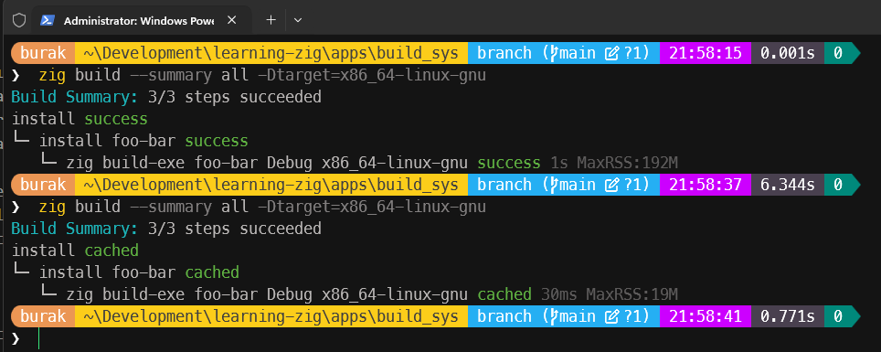
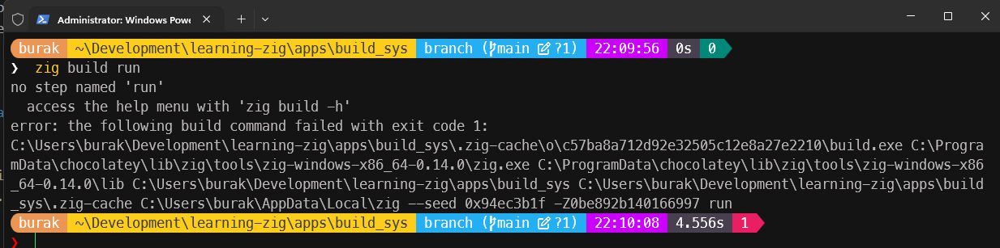
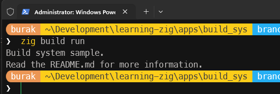

# Zig Build Sistemini Anlamak

Zig için self-hosted bir build sistemi olduğunu ifade edebiliriz. Bu sistemi en basit haliyle anlamak için build.zig dosyasını kendimiz oluşturup denemeler yapabiliriz.

Boş bir klasörde main.zig isimli bir zig kod dosyası olduğunu düşünelim. Burada build sistemini de build.zig isimli bir dosyada tanımlayabiliriz. İlk örnekte aşağıdaki kod parçasını deneyelim.

```zig
const std = @import("std");

pub fn build(b: *std.Build) void {
    // Stage 1: Bir tanımlama adımı olarak düşünebiliriz.
    // Örneğin exe isimli bir Compile artifaktı oluşturuyoruz.
    // Bu çalıştırılabilir bir dosya için gerekli tanımlamaları içeriyor.
    const exe = b.addExecutable(.{
        .name = "foo-bar", // Adı "foo-bar" olan bir executable oluşturuyoruz.
        .root_module = b.createModule((.{
            // İçinde main.zig dosyasını kaynak dosya olarak belirtiyoruz.
            .root_source_file = b.path("main.zig"),
            // Hedef platformu, build sisteminin çalıştığı host platformu olarak ayarlıyoruz.
            // Mesala ben bunu Windows denediğim için Windows'a özgü bir executable oluşturulacak.
            .target = b.graph.host,
        })),
    });

    // Stage 2: Stage 1 de tanımlanan çıktının build sistemine eklenmesi olarak düşünebiliriz.
    b.installArtifact(exe);
}
```

Bu kod parçasında build fonksiyonu, build sisteminin nasıl çalıştığını tanımlayan bir fonksiyondur. Bu fonksiyon içinde iki aşama yer alıyor. İlk aşamada bir executable tanımlanıyor. Bu executable'ın adı "foo-bar" olarak belirleniyor ve kaynak dosya olarak main.zig dosyası kullanılıyor. Hedef platform ise build sisteminin çalıştığı host platformu olarak ayarlanıyor. İkinci aşamada ise tanımlanan executable build sistemine ekleniyor. Aşağıdaki komut ile build işlemini başlatabiliriz.

```bash
# Build işleminde özet almak ve örneği daha iyi gözlemlemek için
# aşağıdaki komut kullanılabilir.
zig build --summary all
```



İlk build işleminde süre biraz uzun olabilir, ancak sonraki build işlemlerinde sadece değişiklik yapılan dosyalar derleneceği için süre oldukça kısalır. Ekran görüntüsünden de dikkat edileceği üzere ikinci özette cached olarak görülen dosyalar, önceki build işleminde oluşturulan ve önbelleğe alınan dosyalardır. Bu da derleme süresini önemli ölçüde azaltır.

Build sonrası kod klasöründe .zig-cache ve zig-out klasörleri oluşur. .zig-cache klasöründe derleme sırasında oluşturulan ara dosyalar ve önbellek bilgileri bulunur. zig-out klasöründe ise derleme sonucunda oluşan executable ve program database vb dosyalar yer alır. Bu içerik tabii derleme yapılan platforma göre değişir.



Bu ilk örnekte derleme çıktısı olarak hedef platform kodun çalıştığı platform olarak belirlendi. Ancak istersek bunu da dışarıdan parametre olarak da alabiliriz. Tek yapmamız gereken komut satırını parametresini alan bir constant değişken kullanmaktan ibaret. Aşağıdaki kod parçasında bu durumu ele alıyoruz.

```zig
const std = @import("std");

pub fn build(b: *std.Build) void {
    // Şimdi derleme çıktısının hangi platforma özgü olacağını
    // komut satırından parametre olarak alacağız
    const target = b.standardTargetOptions(.{});
    const exe = b.addExecutable(.{
        .name = "foo-bar",
        .root_module = b.createModule((.{
            .root_source_file = b.path("main.zig"),
            .target = target, // Komut satırından alınan parametreye göre belirlenecek
        })),
    });

    // Stage 2: Stage 1 de tanımlanan çıktının build sistemine eklenmesi olarak düşünebiliriz.
    b.installArtifact(exe);
}
```

Buna göre örneğin ubuntu plaformu için bir derleme yapmak istersek aşağıdaki komutu kullanabiliriz.

```bash
zig build --summary all -Dtarget=x86_64-linux-gnu
```



Ekleyebileceğimiz bir başka parametrede optimization seviyesidir. Bunu da benzer şekilde komut satırından parametre olarak alabiliriz. Aşağıdaki kod parçasını ele alalım.

```zig
const std = @import("std");

pub fn build(b: *std.Build) void {
    // Hedef platform ve optimizasyon bilgisini komut satırından alıyoruz.
    const target = b.standardTargetOptions(.{});
    const optimize = b.standardOptimizeOption(.{});
    const exe = b.addExecutable(.{
        .name = "foo-bar",
        .root_module = b.createModule((.{
            .root_source_file = b.path("main.zig"),
            .target = target, // Komut satırından alınan parametreye göre belirlenecek
            .optimize = optimize, // Komut satırından alınan optimize seviyesine göre belirlenecek
        })),
    });

    // Stage 2: Stage 1 de tanımlanan çıktının build sistemine eklenmesi olarak düşünebiliriz.
    b.installArtifact(exe);
}
```

DTarget gibi DOptimize ile optimization seviyesini de komut satırından parametre olarak alabiliriz. Optimize seviyesinin alabileceği değerler Debug, ReleaseSafe, ReleaseFast ve ReleaseSmall'dır. Örneğin optimize seviyesini ReleaseFast olarak belirlemek istersek aşağıdaki komutu kullanabiliriz.

```bash
zig build --summary all -Dtarget=x86_64-windows -Doptimize=ReleaseFast
```

Şu ana kadar çıktılar hep zig-out klasöründe oluştu. Ancak istersek bunu da -p komutu üzerinden parametre olarak alabiliriz. Aşağıdaki kod parçasında bu durumu ele alalım.

```bash
zig build --summary all -p output
```

Zig, doğal olarak run komutunu da destekler. Yani derleme aşaması ile birlikte yazılan kodun doğrudan çalıştırılmasını da sağlayabiliriz. Ancak şu anda build pipeline'ı kendimiz ekledik ve run komutunu destekleyecek şekilde yapılandırmadık. O yüzden şimdi denersek hata alırız.

```bash
zig build run
```



Çözüm gayet basittir. Build pipeline'ına run komutunu eklemeliyiz. Aslında bu da build fonksiyonu içerisine yeni bir artifact eklemekten ibarettir. Aşağıdaki kod parçasında bu durumu ele alalım.

```zig
const std = @import("std");

pub fn build(b: *std.Build) void {
    const target = b.standardTargetOptions(.{});
    const optimize = b.standardOptimizeOption(.{});
    const exe = b.addExecutable(.{
        .name = "foo-bar",
        .root_module = b.createModule((.{
            .root_source_file = b.path("main.zig"),
            .target = target,
            .optimize = optimize,
        })),
    });

    b.installArtifact(exe);

    const run = b.addRunArtifact(exe);
    const runStep = b.step("run", "Run Command");
    runStep.dependOn(&run.step);
}
```

Artık aşağıdaki komut çalıştırılabilir.

```bash
zig build run
```



Bu komut çalıştırıldığında önce derleme işlemi yapılır, ardından derlenen executable çalıştırılır. Bu sayede build ve run işlemlerini tek bir komutla gerçekleştirebiliriz.
